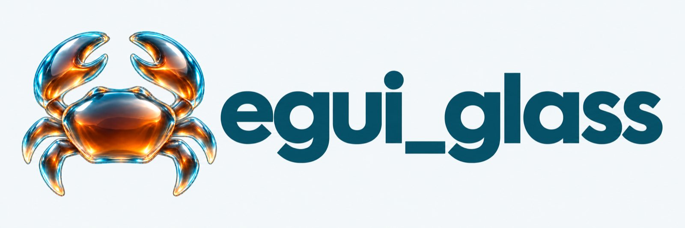
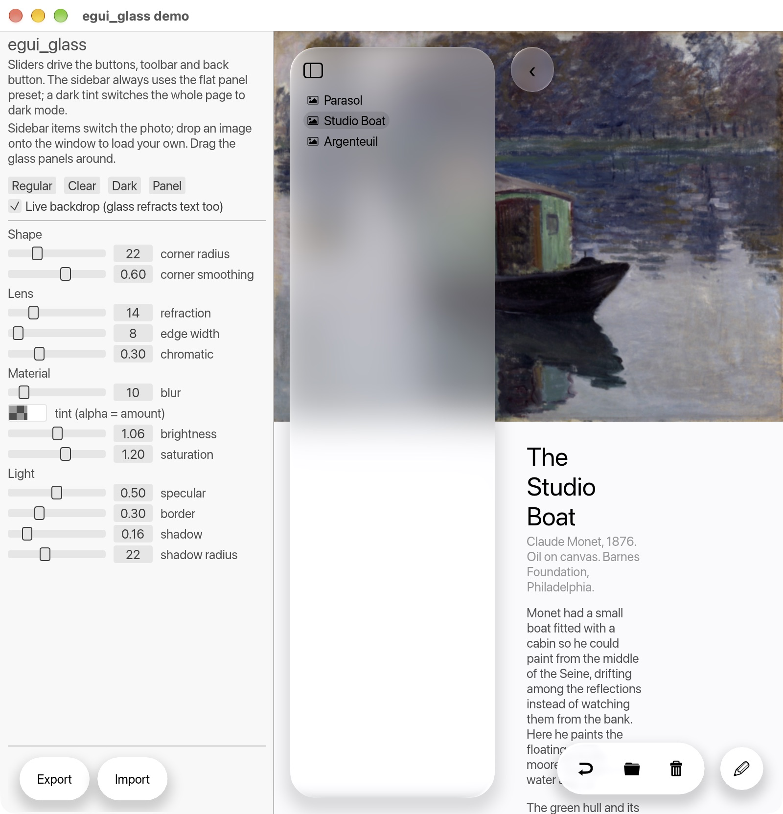

<p align="center">
  
</p>

Apple *Liquid Glass* style surfaces for [egui](https://github.com/emilk/egui), rendered on the GPU
through `egui-wgpu` paint callbacks. One fragment shader does everything: continuous-corner
signed-distance shape, edge refraction (lensing) with optional chromatic aberration, mip-based
backdrop blur, tint / vibrancy, specular rim, inner border and drop shadow. No animation.



## Requirements

| | |
|---|---|
| Rust | 1.92 or newer (MSRV of `eframe` / `wgpu`) |
| Backend | `eframe` with the **wgpu** renderer (`egui-wgpu`); the glow backend is not supported |
| GPU | anything wgpu drives: Metal, Vulkan, DX12 (the demo was developed on macOS) |

Runtime dependencies of the library: `egui`, `egui-wgpu`, `wgpu`, `bytemuck`, and `serde`
(optional, feature `serde`). The demo additionally uses `eframe`, `image`, `serde_json`, `rfd`
and `log`.

## Run the demo

```bash
git clone https://github.com/heonny/egui-glass.git
cd egui-glass
cargo run -p egui_glass_demo
```

The first build compiles wgpu and takes a few minutes. To package it as a macOS app see
[Build the macOS app](#build-the-macos-app). Left panel: sliders for every style
parameter, the presets (Regular, Clear, Dark, Panel), a *Live backdrop* toggle, and Export /
Import buttons that save the settings as JSON. A dark tint switches the page to a macOS-style dark
theme. Sidebar items switch between the bundled photos (`examples/asset`); drop an image file onto
the window to load your own. Drag the glass panels around.

Environment knobs for screenshots: `LG_PHOTO=<index>`, `LG_SCROLL=<px>`, `LG_PRESET=dark|clear`,
`LG_LIVE=0` (start with the live backdrop off).

## Build the macOS app

The demo can be packaged as a regular `.app` (Dock icon, Launchpad, Finder):

| Command | What it does |
|---|---|
| `make` / `make bundle` | release build, `Egui Glass.app` in `target/release/bundle` |
| `make install` | same, then replaces `/Applications/Egui Glass.app` |
| `make run` / `make test` / `make lint` | `cargo run -p egui_glass_demo`, tests, clippy |

`scripts/bundle-macos.sh` does the work: uses the icon from `assets/branding` (the prebuilt
`EguiGlass.icns`, or generates one from a 1024 px PNG you pass as an argument), copies the sample
photos into `Contents/Resources/asset`, writes `Info.plist`, ad-hoc signs the bundle and, with
`--install`, copies it to `/Applications` and strips any quarantine flag. It needs `sips`,
`iconutil` and `codesign`, all part of macOS.

On the first launch from Finder, macOS shows *"Apple could not verify ... is free of malware"*
because the app is not notarized: open *System Settings > Privacy & Security* and click
*Open Anyway* once. To ship a build that opens without the prompt, sign with a Developer ID and
notarize:

```bash
CODESIGN_IDENTITY="Developer ID Application: <name> (<team id>)" \
NOTARY_PROFILE="<keychain profile from: xcrun notarytool store-credentials>" \
make install
```

Uninstall by deleting `/Applications/Egui Glass.app`; the app stores nothing else.

## Use the library in your own app

You do not need this repository checked out; add the crate as a git dependency (pin a `rev` or
`tag` for reproducible builds) and make sure `eframe` uses the wgpu backend:

```toml
[dependencies]
eframe = { version = "0.35", default-features = false, features = ["default_fonts", "wgpu"] }
egui = "0.35"
egui_glass = "0.1"                                     # from crates.io
# egui_glass = { version = "0.1", features = ["serde"] }             # GlassStyle: Serialize / Deserialize
# egui_glass = { git = "https://github.com/heonny/egui-glass.git" }   # or track the repository
```

Minimal app (also in the repo as `examples/demo/examples/minimal.rs`, run it with
`cargo run -p egui_glass_demo --example minimal`): register the pipeline and a backdrop once, then
draw glass wherever you like.

```rust
use eframe::egui;
use egui_glass::{Glass, GlassButton, GlassStyle, GlassToolbar};

struct App;

impl App {
    fn new(cc: &eframe::CreationContext<'_>) -> Self {
        let rs = cc.wgpu_render_state.as_ref().expect("eframe must use the wgpu renderer");
        egui_glass::init(rs, 1);                                   // msaa samples of NativeOptions
        let wallpaper = egui::ColorImage::filled([256, 256], egui::Color32::from_rgb(70, 130, 180));
        egui_glass::set_backdrop(&cc.egui_ctx, rs, &wallpaper);    // any ColorImage: photo, gradient, ...
        Self
    }
}

impl eframe::App for App {
    fn ui(&mut self, ui: &mut egui::Ui, _frame: &mut eframe::Frame) {
        egui::CentralPanel::default().frame(egui::Frame::NONE).show(ui, |ui| {
            egui_glass::show_backdrop(ui, ui.max_rect());          // draw the backdrop, record where it is
            let style = GlassStyle::regular();
            egui::Area::new(egui::Id::new("card")).movable(true).constrain(false).show(ui.ctx(), |ui| {
                Glass::new(style).show(ui, |ui| {
                    ui.heading("Hello glass");
                    GlassButton::new("Continue").style(style).show(ui);
                });
            });
            egui::Area::new(egui::Id::new("bar")).movable(true).constrain(false).show(ui.ctx(), |ui| {
                GlassToolbar::new(style).show(ui, |ui| {
                    let _ = ui.button("Undo");
                    let _ = ui.button("Share");
                });
            });
        });
    }
}

fn main() -> eframe::Result {
    let options = eframe::NativeOptions { renderer: eframe::Renderer::Wgpu, ..Default::default() };
    eframe::run_native("glass", options, Box::new(|cc| Ok(Box::new(App::new(cc)))))
}
```

API at a glance:

| | |
|---|---|
| `init(render_state, msaa)` | once; installs the wgpu pipeline |
| `set_backdrop(ctx, rs, &ColorImage)` | upload / replace the image glass refracts |
| `show_backdrop(ui, rect)` | draw it aspect-filled in `rect` and record the mapping |
| `show_backdrop_mapped(ui, image_rect, clip, outside)` | place it yourself; `outside` is what glass shows beyond it |
| `Glass::new(style).inner_margin(..).show(ui, ..)` | card / section / sidebar container |
| `GlassButton::new(text).style(..).icon().show(ui)` | capsule or round button |
| `GlassToolbar::new(style).show(ui, ..)` | capsule bar of flat buttons |
| `paint_glass(ui, rect, &style)` | just the surface, for custom widgets |
| `LiveBackdrop::new(rs, fonts)` / `.run(ui, page_color, ..)` | glass refracts live content, see below |
| `register_native_texture(rs, &view)` | egui texture id usable in both normal and live passes |

`GlassStyle` fields (all in logical points): `corner_radius` (`f32::INFINITY` = capsule),
`corner_smoothing` (0 = circular arc, 0.6 = the continuous look of iOS corners, 1 = max), `blur`,
`refraction`, `edge_width`, `chromatic`, `tint`, `brightness`, `saturation`, `specular`, `border`,
`shadow`, `shadow_radius`. Presets: `regular()`, `clear()`, `dark()`, `panel()`, `panel_dark()`.
Use `panel()` for large surfaces (sidebars, sheets): heavy blur, almost no lensing. Text on glass
picks a light colour automatically when the tint is dark.

Corners use the corner-smoothing model popularised by Figma (a Bezier ease into a shorter circular
arc, spanning `(1 + smoothing) * radius` along each edge), evaluated as a signed-distance field in
the shader. No Apple curve constants are used.

## How it works / limits

egui paints in a single render pass, so a shader cannot read the pixels already drawn behind a
widget in the same frame. By default glass therefore refracts a **backdrop image** you register
with `set_backdrop` (a wallpaper, a photo) and place with `show_backdrop`; anything egui draws on
top of it shows as the page colour through the glass. This is cheap and matches Apple's guidance
that glass floats above content and is never stacked on glass.

Each glass surface costs one draw call (a single triangle) and one 256-byte uniform slot; the
backdrop is uploaded once with a linear-light mip chain, and blur is a 5-tap sample at a mip level.

### Live backdrop (optional)

`LiveBackdrop` lifts that limit: the content you pass to `LiveBackdrop::run` is laid out a second
time in a twin egui context (same memory, no input events) and rendered off screen without the
glass, then used as this frame's backdrop. Glass then refracts everything beneath it, text
included, with no frame of lag. The cost is one extra layout and draw of that content per frame.

```rust
// once, after init and before set_backdrop / register_native_texture
let live = LiveBackdrop::new(rs, Some(font_definitions));
// every frame: content inside, glass outside
live.run(ui, page_color, |ui| page(ui));
Glass::new(style).show(ui, |ui| { /* floats over the page */ });
```

Images drawn inside the content must be registered with `egui_glass::register_native_texture`
(or `set_backdrop`) so the off-screen pass can draw them too.

## Development

```bash
cargo test --workspace --all-features
cargo clippy --workspace --all-targets --all-features
```

See `CLAUDE.md` for the project layout and the design rules the code follows.

## Trademark note

"Liquid Glass" is Apple's name for its design language; `egui_glass` is an independent
reimplementation of the *look*, not affiliated with or endorsed by Apple. The term is only used
descriptively in this documentation.

## License

MIT. See [LICENSE](LICENSE).
