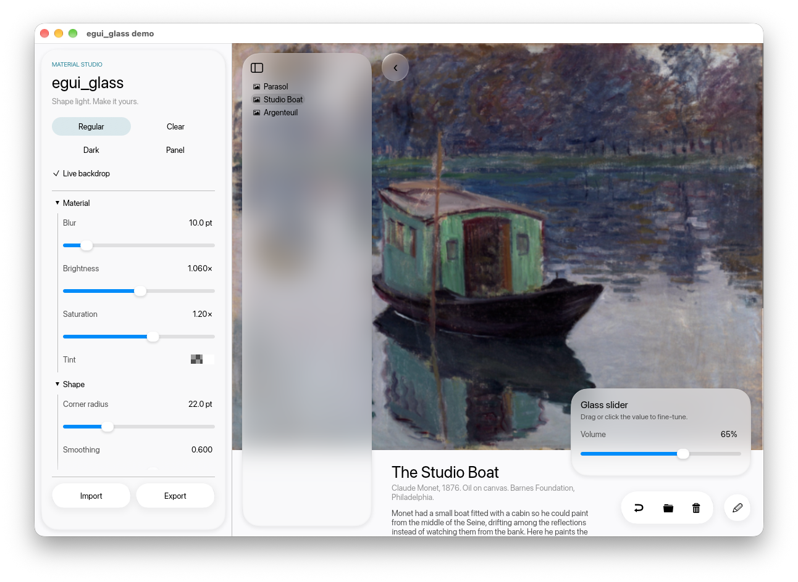

# egui_glass

Apple *Liquid Glass* style surfaces for [egui](https://github.com/emilk/egui), rendered on the GPU
through `egui-wgpu` paint callbacks. One fragment shader does everything: rounded-rect SDF,
edge refraction (lensing) with optional chromatic aberration, mip-based backdrop blur,
tint / vibrancy, specular rim, inner border and drop shadow. No animation, no dependencies
beyond `egui`, `egui-wgpu`, `wgpu`, `bytemuck`.



## Usage

```rust
// once, e.g. in App::new (eframe with the wgpu backend)
let rs = cc.wgpu_render_state.as_ref().unwrap();
egui_glass::init(rs, 1 /* msaa samples */);
egui_glass::set_backdrop(&cc.egui_ctx, rs, &wallpaper_color_image);

// every frame
egui_glass::show_backdrop(ui, ui.max_rect());   // draws the wallpaper (aspect-fill), records its mapping
// or place the image yourself: show_backdrop_mapped(ui, image_rect, clip_rect)

let style = GlassStyle::regular();                      // or ::clear(), ::dark(), or tweak fields
Glass::new(style).show(ui, |ui| { ui.label("card / section / sidebar"); });
GlassButton::new("Continue").style(style).show(ui);
GlassToolbar::new(style).show(ui, |ui| { ui.button("↩"); ui.button("🗑"); });
paint_glass(ui, rect, &style);                          // building block for your own widgets
```

`GlassStyle` fields (all in logical points): `corner_radius` (`f32::INFINITY` = capsule),
`corner_smoothing` (0 = circular arc, 0.6 = the continuous look of iOS corners, 1 = max), `blur`,
`refraction`, `edge_width`, `chromatic`, `tint`, `brightness`, `saturation`, `specular`, `border`,
`shadow`, `shadow_radius`.

Corners use the corner-smoothing model popularised by Figma (a Bezier ease into a shorter circular
arc, spanning `(1 + smoothing) * radius` along each edge), evaluated as a signed-distance field in
the shader. No Apple curve constants are used.

## How it works / limits

egui paints in a single render pass, so a shader cannot read the pixels already drawn behind a
widget in the same frame. Glass therefore refracts a **backdrop image** you register with
`set_backdrop` (a wallpaper, a photo, a composited screenshot of your content) and place with
`show_backdrop`. Anything egui draws on top of that backdrop is not refracted. This matches
Apple's guidance that glass floats above content and is never stacked on glass.

Each glass surface costs one draw call (a single triangle) and one 256-byte uniform slot; the
backdrop is uploaded once with a CPU-generated mip chain, and blur is a 5-tap sample at a mip level.

## Demo

```bash
cargo run -p egui_glass_demo
```

Left panel: sliders for every style parameter and the three presets. Drop an image file on the
window to change the photo; drag the glass panels around. Sidebar items switch between the photos
in `examples/asset`; portrait photos are laid out as a tall column on the right, landscape ones
across the top.

## Trademark note

"Liquid Glass" is Apple's name for its design language; `egui_glass` is an independent
reimplementation of the *look*, not affiliated with or endorsed by Apple. The term is only used
descriptively in this documentation.

## License

MIT OR Apache-2.0
